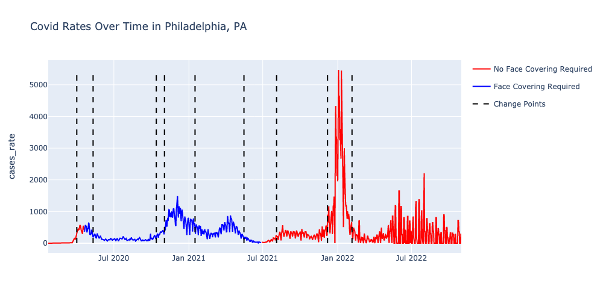
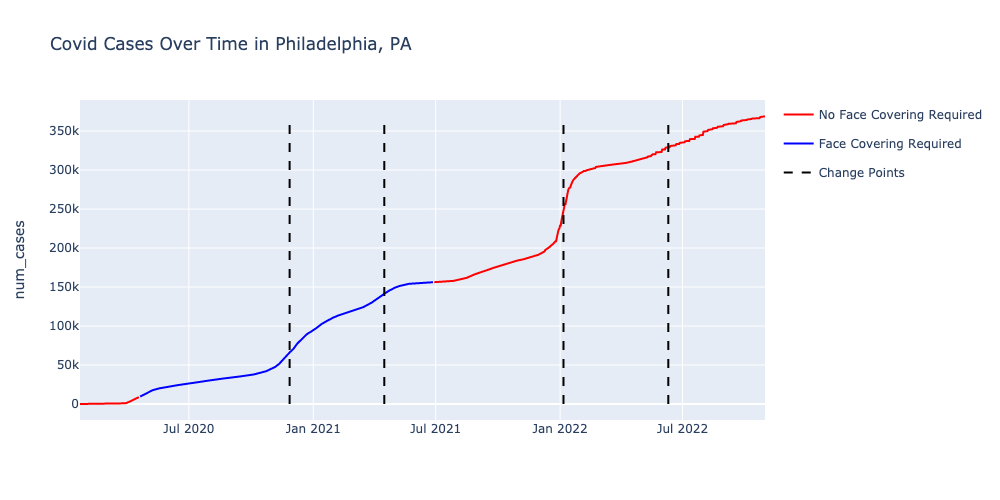
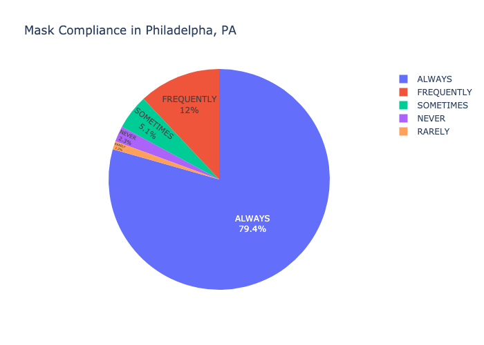
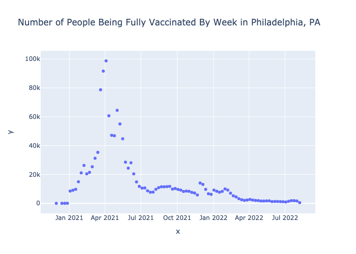
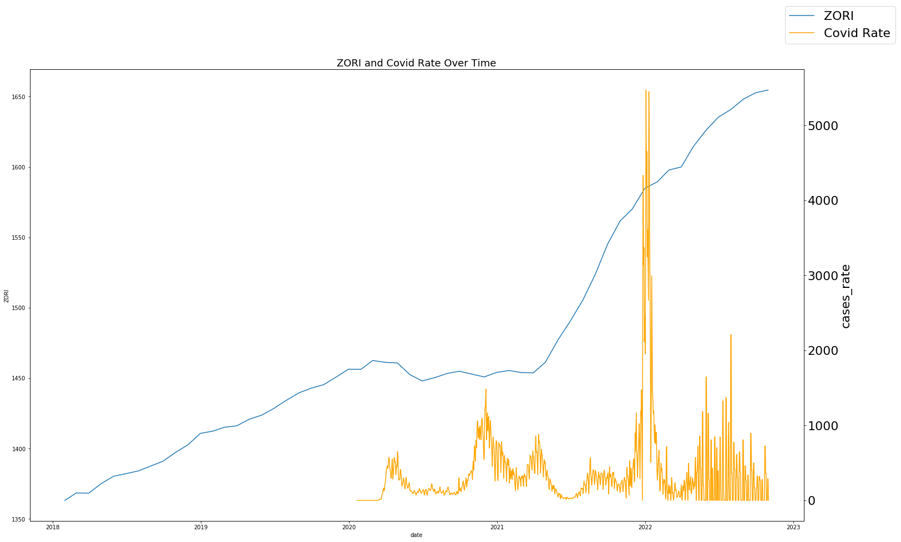
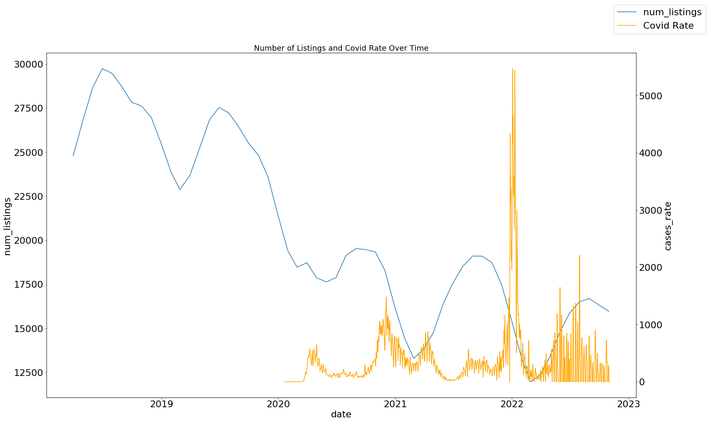
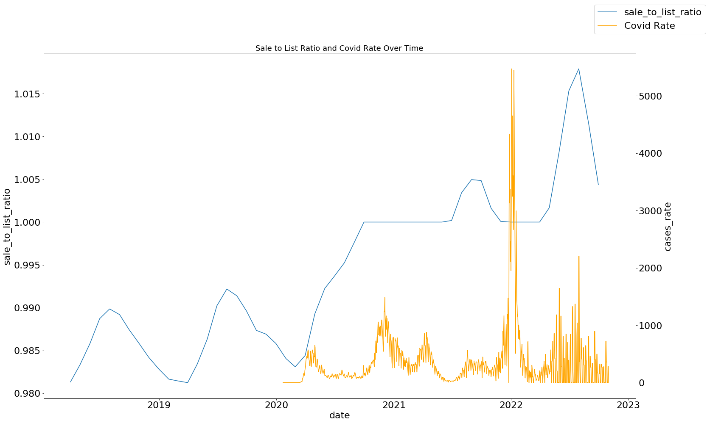

# DATA 512 Final Project Repository

## Project Goal
The first goal of this project is to collaborate with my peers to analyze Covid-19 data as well as mask mandate data to answer the question How did masking policies change the progression of confirmed COVID-19 cases from February 1, 2020 through October 1, 2021? Next I would like to analyze how the progression of Covid-19 affected the housing market in Philadelphia, PA. I aim to perform a human-centered analysis and use the techniques I've learned in DATA512 over the quarter to answer both of these questions.

## Project Description
For this project we use Covid-19 Cases data from Johns-Hopkins, CDC data about mask mandates and data from the New York Times mask compliance survey to create visualizations to analyze how masking policies changed the progression of confirmed COVID-19 cases. We will also be using housing data from Zillow including average rent price by month, average number of listings per month and average sale to list raio per month for Philadelphia county and examning how these values change in relation to the progression of the Covid-19 pandemic.

## Project Files

- RAW_us_confirmed_cases.csv: CSV data of number of confirmed cases by county
- U.S._State_and_Territorial_Public_Mask_Mandates_From_April_10__2020_through_August_15__2021_by_County_by_Day.csv: CSV data of mask mandates by county
- mask-use-by-county.csv: CSV data of survey mask compliance from the NYT by county
- covid_vaccines_by_date.csv: CSV data of number of people vaccinated per day in Philadelphia
- County_zori_sm_sa_month.csv: Data about Zillow Observed Rent Index (ZORI),  a smoothed measure of the typical observed market rate rent across a given region.The index is dollar-denominated by computing the mean of listed rents that fall into the 40th to 60th percentile range for all homes and apartments in a given region. This data is separated by counties all across America and has data monthly from March 2015 to September 2022. There is also a dataset available that adjusts for seasonality. This will help me answer the question by giving access to how the mean rent has changed before, during and after the pandemic which will allow us to compare that change to the rate of change in covid cases.
- Metro_invt_fs_uc_sfrcondo_sm_month.csv: Data about current listings on Zillow. The data includes the count of unique listings that were active at any time in a given month. This includes data from March 2018 to September 2022 with the number of listings reported for each month. This will help me answer the question by giving access to how the number of listings has changed before, during and after the pandemic which will allow us to compare that change to the rate of change in covid cases.
- Metro_median_sale_to_list_uc_sfrcondo_sm_month.csv: This includes data from March 2018 to September 2022 with the ratio of sale vs. final price monthly. This will help me answer the question by giving access to how the sale to list ratio has changed before, during and after the pandemic which will allow us to compare that change to the rate of change in covid cases. We will be able to examine if houses sold over or under the listing rate over the course of a couple years.

## Output Files

**Note:** Analysis of Graphs can be found in the Final Project Report

 Graph of the rates of COVID-19 in Philadelphia over time
 
  
  Graph of the number of COVID-19 cases in Philadelphia over time
  
   
  
  Pie Chart of survey data of COVID-19 compliance in Philadelphia
  
   
  
  Graph of number of people vaccinated per week in Philadelphia
  
   
  
  Graph of ZORI and Covid-19 rates over time
  
   
  
  Graph of number of listings and Covid-19 rates over time
  
   
  
  Graph of the sale to list ratio and Covid-19 rates over time
  
  - DATA512 Final Project.ipynb: Jupyter notebook of all code used to create visualizations and perform statistical tests
  
  - DATA512 Final Report.pdf: Final Written Report of entire project
  
  
## Project Sources and Licenses
[US Confirmed Cases](https://www.kaggle.com/datasets/antgoldbloom/covid19-data-from-john-hopkins-university)

[US Mask Mandates](https://data.cdc.gov/Policy-Surveillance/U-S-State-and-Territorial-Public-Mask-Mandates-Fro/62d6-pm5i)

[Mask Compliance](https://github.com/nytimes/covid-19-data/tree/master/mask-use)

[Philadelphia Vaccine Data](https://www.phila.gov/programs/coronavirus-disease-2019-covid-19/vaccines/vaccine-data/)

[All Zillow Data] (https://www.zillow.com/research/data/)
